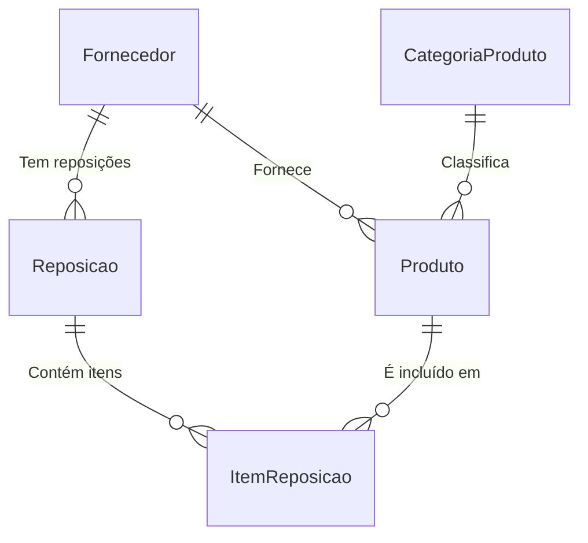

#  Sistema de Controle de Estoque

Este é um projeto de um sistema de **Controle de Estoque** desenvolvido em **Java** com banco de dados **MySQL**. O sistema permite gerenciar produtos, fornecedores, categorias e controlar a entrada e saída de materiais de forma eficiente.

##  Descrição

O sistema foi pensado para atender empresas que trabalham com materiais como: linhos, plásticos, viés, elástico, tecido, cursor, entre outros. Com ele, é possível ter controle completo do estoque, visualizar históricos, cadastrar fornecedores, acompanhar a produção e muito mais.

---

##  Objetivos do Projeto

- Controlar o estoque de forma eficiente.
- Registrar entradas e saídas de produtos.
- Manter histórico de fornecedores.
- Acompanhar pedidos de saída.
- Gerar relatórios de movimentações de estoque.

---

## Requisitos Funcionais

-  Cadastro de fornecedores por estado (UF)
-  Registro do estoque atual de materiais
-  Alertas para estoque mínimo
-  Cadastro do tempo de permanência dos materiais
-  Controle de entrada e saída de materiais
-  Organização dos materiais por prateleiras
-  Visualização de histórico de movimentações
-  Registro manual de materiais (quando offline)
-  Cadastro da produção diária e suas ordens
-  Definição de produções fixas e específicas por cliente
-  Combinação de produtos
-  Visualização dos itens com imagens e especificações

---

##  Requisitos Não Funcionais

-  Alta disponibilidade (99% do tempo)
-  Interface responsiva (mobile e desktop)
-  Segurança com autenticação e permissões por perfil
-  Salvamento automático de dados críticos
-  Tempo de resposta inferior a 2 segundos
-  Backup automático diário
-  Conformidade com a LGPD
-  Integração com emissão de NF-e
-  Suporte a pelo menos 50 usuários simultâneos
-  Comunicação segura via HTTPS

---

##  Modelo de Dados - Sistema de Controle de Estoque

###  Entidades e Relacionamentos

| Entidade          | Atributos Principais                                                                                     | Relacionamentos                                                                                                                                                  | Cardinalidade                                    |
|-------------------|-----------------------------------------------------------------------------------------------------------|------------------------------------------------------------------------------------------------------------------------------------------------------------------|-------------------------------------------------|
| **Fornecedor**    | id (PK), nome, cnpj, telefone, email                                                                      | - Fornece produtos → Produto <br> - Fornece reposições → Reposição                                                        | 1 fornecedor → N produtos <br> 1 fornecedor → N reposições |
| **CategoriaProduto** | id (PK), nome, descricao                                                                               | - Classifica produtos → Produto                                                                                           | 1 categoria → N produtos                        |
| **Produto**       | id (PK), nome, preco, quantidade, id_categoria (FK), id_fornecedor (FK)                                   | - Pertence a 1 fornecedor <br> - Pertence a 1 categoria <br> - Está em N itens de reposição → ItemReposicao                | 1 produto → N itens de reposição                |
| **Reposicao**     | id (PK), data, id_fornecedor (FK), observacao                                                              | - Realizada por 1 fornecedor <br> - Possui N itens de reposição → ItemReposicao                                           | 1 reposição → N itens                           |
| **ItemReposicao** | id (PK), id_reposicao (FK), id_produto (FK), quantidade, preco_unitario                                   | - Relaciona uma reposição com os produtos                                                                                 | N itens → 1 reposição <br> N itens → 1 produto  |

---

###  Relacionamentos e Cardinalidades

- **Fornecedor → Produto**  
   Um fornecedor fornece **vários produtos** (1:N)

- **CategoriaProduto → Produto**  
   Uma categoria classifica **vários produtos** (1:N)

- **Fornecedor → Reposicao**  
   Um fornecedor pode estar associado a **várias reposições** (1:N)

- **Reposicao → ItemReposicao**  
   Uma reposição possui **vários itens** (1:N)

- **Produto → ItemReposicao**  
   Um produto pode estar presente em **vários itens de reposição** (1:N)

---

###  Diagrama Entidade-Relacionamento (Descrição Textual)

- **Fornecedor** se conecta com **Produto** (1:N) e com **Reposicao** (1:N)  
- **CategoriaProduto** se conecta com **Produto** (1:N)  
- **Produto** se conecta com **ItemReposicao** (1:N)  
- **Reposicao** se conecta com **ItemReposicao** (1:N)  

---
##  Diagrama de Relacionamentos (Cardinalidades)



Legenda:

|| → Um (1)

o{ → Muitos (N)

-- → Relacionamento

---
##  Como Rodar o Projeto na sua Máquina

###  Pré-requisitos

-  Java JDK 11 ou superior instalado
-  MySQL Server instalado e rodando
-  Driver JDBC do MySQL (mysql-connector-java)
-  IDE (IntelliJ, Eclipse, NetBeans, VSCode) ou terminal

###  Passos para executar

1. **Clone o repositório no seu computador:**

```bash
git clone https://github.com/DevOtaviox/A3---Programacao-de-Solucoes-Computacionais.git
cd A3---Programacao-de-Solucoes-Computacionais
```

2. **Configure o Banco de Dados:**

- Abra o **MySQL Workbench**, **DBeaver** ou outro cliente MySQL.
- Execute o script SQL acima para criar o banco `sistema_estoque` e as tabelas.

3. **Configure a conexão no Java:**

No seu código Java, altere os dados de conexão conforme seu ambiente:

```java
String url = "jdbc:mysql://localhost:3306/sistema_estoque";
String user = "root"; // seu usuário do MySQL
String password = "sua_senha"; // sua senha do MySQL
```

4. **Adicione o driver JDBC (MySQL Connector):**

- Se estiver usando Maven, adicione no `pom.xml`:

```xml
<dependency>
    <groupId>mysql</groupId>
    <artifactId>mysql-connector-java</artifactId>
    <version>8.0.33</version>
</dependency>
```

- Se não usar Maven:
  - Baixe o arquivo `mysql-connector-java-8.0.33.jar` [aqui](https://dev.mysql.com/downloads/connector/j/).
  - Adicione este `.jar` no classpath da sua IDE.

5. **Compile e execute:**

- Na sua IDE, clique em **Run** no arquivo principal (`Main.java` ou similar).

- Ou pelo terminal:

```bash
javac -cp ".;mysql-connector-java-8.0.33.jar" Main.java
java -cp ".;mysql-connector-java-8.0.33.jar" Main
```

>  No Linux ou Mac, use `:` ao invés de `;` no classpath:
```bash
javac -cp ".:mysql-connector-java-8.0.33.jar" Main.java
java -cp ".:mysql-connector-java-8.0.33.jar" Main
```

---

##  Tecnologias Utilizadas

- Java
- MySQL
- JDBC (Java Database Connectivity)
- SQL
- [IDE de sua preferência]

---

##  Possíveis Expansões Futuras

- Implementação de **Triggers** para atualização automática de estoque.
- Criação de **Views** para facilitar consultas.
- Integração com um sistema web ou aplicativo de gestão de estoque.

---
